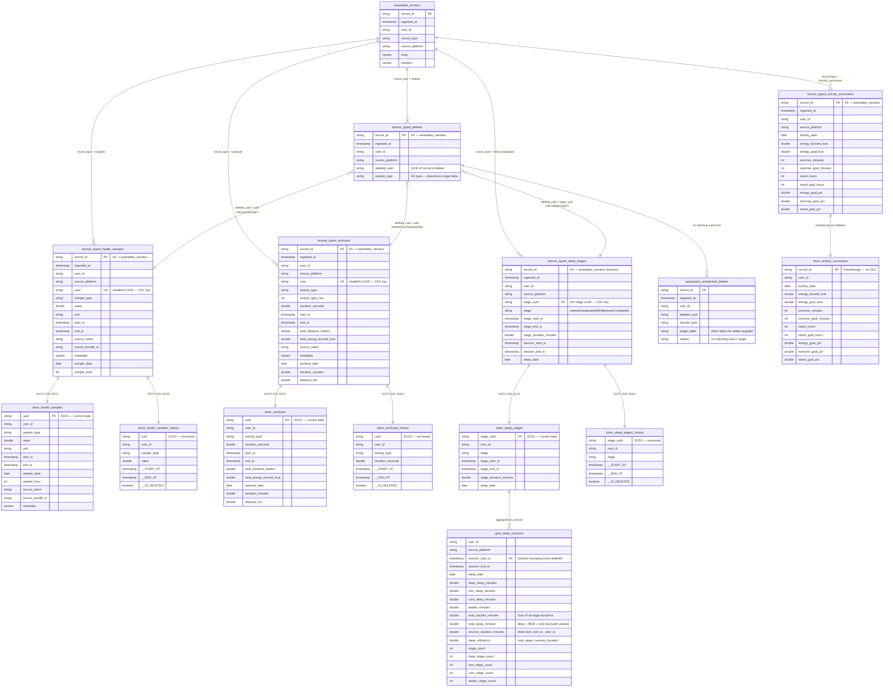

# HealthKit Pipeline — Data Model & Architecture

## Overview

A four-layer Spark Declarative Pipeline that processes raw VARIANT-encoded HealthKit data from the ZeroBus bronze table into typed, delete-aware silver tables with full SCD history, and session-level gold aggregations.

**Pipeline**: `[dev] HealthKit Pipeline` (continuous, serverless, Photon)
**Source**: `hls_fde_dev.dev_matthew_giglia_wearables.wearables_zerobus`
**Target schema**: `hls_fde_dev.dev_matthew_giglia_wearables`

---

## Architecture

```
wearables_zerobus (raw bronze — VARIANT, append-only)
│
│  ┌─── STRUCTURING (fan-out by record_type, type VARIANT → columns) ───┐
│  │                                                                      │
├──►  bronze_typed_health_samples    (one row per sample, keyed on uuid)
├──►  bronze_typed_workouts          (one row per workout, keyed on uuid)
├──►  bronze_typed_sleep_stages      (one row per STAGE, exploded, keyed on stage uuid)
├──►  bronze_typed_activity_summaries(one row per day per user)
├──►  bronze_typed_deletes           (one row per delete event)
│  │                                                                      │
│  └──────────────────────────────────────────────────────────────────────┘
│
│  ┌─── CDC VIEWS (UNION typed records + matching deletes, tag operation) ──┐
│  │                                                                         │
│  │  cdc_health_samples_v    (INSERT from samples, DELETE from deletes)
│  │  cdc_workouts_v          (INSERT from workouts, DELETE from deletes)
│  │  cdc_sleep_stages_v      (INSERT from stages, DELETE from deletes)
│  │                                                                         │
│  └─────────────────────────────────────────────────────────────────────────┘
│
│  ┌─── SILVER (AUTO CDC — deletes physically applied) ───────────────────┐
│  │                                                                         │
├──►  silver_health_samples          (SCD Type 1 — current state only)
├──►  silver_health_samples_history  (SCD Type 2 — full change history)
├──►  silver_workouts                (SCD Type 1)
├──►  silver_workouts_history        (SCD Type 2)
├──►  silver_sleep_stages            (SCD Type 1)
├──►  silver_sleep_stages_history    (SCD Type 2)
├──►  silver_activity_summaries      (streaming table — no deletes exist)
│  │                                                                         │
│  └─────────────────────────────────────────────────────────────────────────┘
│
│  ┌─── GOLD (aggregations & metric views) ─────────────────────────────────┐
│  │                                                                         │
├──►  gold_sleep_sessions            (session-level agg from silver stages)
├──►  (future metric views)
│  │                                                                         │
│  └─────────────────────────────────────────────────────────────────────────┘
│
│  ┌─── QUARANTINE ─────────────────────────────────────────────────────────┐
│  │                                                                         │
├──►  quarantine_unmatched_deletes   (deletes with no matching record)
│  │                                                                         │
│  └─────────────────────────────────────────────────────────────────────────┘
```

---

## Entity Relationship Diagram



---

## Table Inventory

### Layer 1: Bronze Typed (Structured, Append-Only)

These tables structure the raw VARIANT data into typed columns. They are **append-only streaming tables** that serve as the full audit trail. No records are ever removed.

| Table | Grain | PK / CDC Key | Cluster Keys | Source Filter |
| --- | --- | --- | --- | --- |
| `bronze_typed_health_samples` | One row per sample | `uuid` | user_id, sample_type, sample_date | `record_type = 'samples'` |
| `bronze_typed_workouts` | One row per workout | `uuid` | user_id, activity_type, workout_date | `record_type = 'workouts'` |
| `bronze_typed_sleep_stages` | One row per sleep stage | `stage_uuid` | user_id, sleep_date | `record_type = 'sleep'` (exploded) |
| `bronze_typed_activity_summaries` | One row per user per day | `record_id` | user_id, activity_date | `record_type = 'activity_summaries'` |
| `bronze_typed_deletes` | One row per delete event | `record_id` | sample_type, deleted_uuid | `record_type = 'deletes'` |

### Layer 2: Silver (CDC-Applied, Delete-Aware)

These tables are produced by `dp.create_auto_cdc_flow()`. Each entity has **both** SCD Type 1 (current state, deletes physically removed) and SCD Type 2 (full history with `__START_AT`, `__END_AT`, `__IS_DELETED` columns).

| Table | SCD Type | CDC Key | Sequence By | Delete Condition |
| --- | --- | --- | --- | --- |
| `silver_health_samples` | 1 | `uuid` | `ingested_at` | `operation = 'DELETE'` |
| `silver_health_samples_history` | 2 | `uuid` | `ingested_at` | `operation = 'DELETE'` |
| `silver_workouts` | 1 | `uuid` | `ingested_at` | `operation = 'DELETE'` |
| `silver_workouts_history` | 2 | `uuid` | `ingested_at` | `operation = 'DELETE'` |
| `silver_sleep_stages` | 1 | `stage_uuid` | `ingested_at` | `operation = 'DELETE'` |
| `silver_sleep_stages_history` | 2 | `stage_uuid` | `ingested_at` | `operation = 'DELETE'` |
| `silver_activity_summaries` | N/A | `record_id` | N/A | No deletes (streaming table) |

### Layer 3: Gold (Aggregations)

| Table | Type | Source | Grain | Cluster Keys |
| --- | --- | --- | --- | --- |
| `gold_sleep_sessions` | Materialized View | `silver_sleep_stages` | One row per user per sleep session | user_id, sleep_date |

**`gold_sleep_sessions` columns:**

| Column | Description |
| --- | --- |
| `deep_sleep_minutes` | Total deep sleep duration in session |
| `rem_sleep_minutes` | Total REM duration |
| `core_sleep_minutes` | Total core/light sleep |
| `awake_minutes` | Total awake time within session window |
| `total_tracked_minutes` | Sum of all stage durations (deep + REM + core + awake) |
| `total_sleep_minutes` | deep + REM + core (excludes awake) |
| `session_duration_minutes` | Wall-clock time: `session_end_ts - session_start_ts` |
| `sleep_efficiency` | `total_sleep_minutes / session_duration_minutes` |
| `stage_count` | Total number of stages in session |
| `{deep,rem,core,awake}_stage_count` | Per-type stage counts |

### Quarantine

| Table | Purpose |
| --- | --- |
| `quarantine_unmatched_deletes` | Delete events whose `deleted_uuid` has no matching record in the target bronze typed table. Expected to be ~99% of sample deletes in dev (historical orphans from HealthKit anchored queries). Valuable in production for detecting sync ordering issues. |

---

## CDC Design

### How Deletes Map to Tables

The `sample_type` field in delete records determines which table the delete targets:

| sample_type Pattern | Target Table | CDC Key |
| --- | --- | --- |
| `HKQuantityType*` (HeartRate, StepCount, SpO2, HRV, etc.) | `silver_health_samples` | `uuid` |
| `HKWorkoutTypeIdentifier` | `silver_workouts` | `uuid` |
| `HKCategoryTypeIdentifierSleepAnalysis` | `silver_sleep_stages` | `stage_uuid` |
| (none observed) | `silver_activity_summaries` | N/A — no deletes |

### CDC View Pattern

Each CDC view unions INSERT operations (from the bronze typed table) with DELETE operations (from bronze_typed_deletes), creating a unified change feed:

```python
@dp.view(name="cdc_health_samples_v")
def cdc_health_samples_v():
    inserts = (
        spark.readStream.table("bronze_typed_health_samples")
        .withColumn("operation", F.lit("INSERT"))
    )
    deletes = (
        spark.readStream.table("bronze_typed_deletes")
        .filter(F.col("sample_type").startswith("HKQuantityType"))
        .select(
            F.col("deleted_uuid").alias("uuid"),
            F.col("ingested_at"),
            F.lit("DELETE").alias("operation"),
        )
    )
    return inserts.unionByName(deletes, allowMissingColumns=True)
```

### AUTO CDC Pattern (SCD1 + SCD2)

```python
# SCD Type 1 — config-driven table definition with schema DDL
_cfg = load_table_config("silver_health_samples")

dp.create_streaming_table(
    name="silver_health_samples",
    comment=get_table_comment(_cfg),
    schema=build_schema_ddl(_cfg),  # Column comments + PK constraint from YAML
    table_properties=get_table_properties(_cfg),
    cluster_by=get_cluster_by(_cfg),
)

dp.create_auto_cdc_flow(
    target="silver_health_samples",
    source="cdc_health_samples_v",
    keys=["uuid"],
    sequence_by=F.col("ingested_at"),
    apply_as_deletes=F.expr("operation = 'DELETE'"),
    except_column_list=["operation", "record_id"],
    stored_as_scd_type=1,
)

# SCD Type 2 — full history with __START_AT, __END_AT, __IS_DELETED
dp.create_streaming_table("silver_health_samples_history",
    cluster_by=["user_id", "sample_type", "sample_date"])

dp.create_auto_cdc_flow(
    target="silver_health_samples_history",
    source="cdc_health_samples_v",
    keys=["uuid"],
    sequence_by=F.col("ingested_at"),
    apply_as_deletes=F.expr("operation = 'DELETE'"),
    except_column_list=["operation", "record_id", "metadata"],
    stored_as_scd_type=2,
)
```

**Note:** SCD2 flows must exclude VARIANT columns (e.g. `metadata`) from change tracking because the `<=>` (null-safe equality) operator doesn't support VARIANT in window functions.

### Quarantine Pattern

Unmatched deletes are captured via a LEFT ANTI JOIN materialized view:

```python
@dp.materialized_view(name="quarantine_unmatched_deletes")
def quarantine_unmatched_deletes():
    deletes = spark.read.table("bronze_typed_deletes")
    samples = spark.read.table("bronze_typed_health_samples").select(
        F.col("uuid").alias("existing_uuid"))
    workouts = spark.read.table("bronze_typed_workouts").select(
        F.col("uuid").alias("existing_uuid"))
    stages = spark.read.table("bronze_typed_sleep_stages").select(
        F.col("stage_uuid").alias("existing_uuid"))
    all_uuids = samples.union(workouts).union(stages)

    return (
        deletes.join(all_uuids, deletes.deleted_uuid == all_uuids.existing_uuid, "left_anti")
        .withColumn("target_table", ...)
        .withColumn("reason", F.lit("no matching uuid in target"))
    )
```

---

## Config-Driven Architecture (fixtures/ddl/)

Table metadata — column comments, types, constraints, expectations — is defined in
YAML fixture files and loaded at pipeline runtime by the `lib.table_config` module.

### File Structure

```
fixtures/ddl/
├── bronze_typed_health_samples.yml
├── bronze_typed_workouts.yml
├── bronze_typed_sleep_stages.yml
├── bronze_typed_activity_summaries.yml
├── bronze_typed_deletes.yml
├── silver_health_samples.yml
├── silver_workouts.yml
├── silver_sleep_stages.yml
├── silver_activity_summaries.yml
└── gold_sleep_sessions.yml        (table comment + column docs only — MVs can't use schema DDL)
```

### YAML Schema (per file)

```yaml
table:
  name: bronze_typed_health_samples
  layer: bronze
  type: streaming_table
  comment: "..."
  properties: { quality: bronze, delta.enableChangeDataFeed: "true", ... }
  cluster_by: [user_id, sample_type, sample_date]

columns:
  - name: record_id
    type: STRING
    nullable: false
    comment: "Bronze record GUID — 1:1 with source ingestion row"
  # ...

constraints:
  primary_key:
    name: bronze_typed_health_samples_pk
    columns: [record_id]
  foreign_keys:
    - name: bronze_typed_health_samples_bronze_fk
      columns: [record_id]
      references: { table: wearables_zerobus, columns: [record_id] }

expectations:
  drop:   { valid_record_id: "record_id IS NOT NULL", valid_uuid: "uuid IS NOT NULL" }
  warn:   { valid_user: "user_id IS NOT NULL", ... }
```

### How It Works

```python
from lib.table_config import load_table_config, build_schema_ddl, ...

_cfg = load_table_config("bronze_typed_health_samples")

dp.create_streaming_table(
    name="bronze_typed_health_samples",
    comment=get_table_comment(_cfg),
    schema=build_schema_ddl(_cfg),           # Column comments + PK in DDL
    table_properties=get_table_properties(_cfg),
    cluster_by=get_cluster_by(_cfg),
    expect_all_or_drop=get_expectations_drop(_cfg),
    expect_all=get_expectations_warn(_cfg),
)

@dp.append_flow(target="bronze_typed_health_samples")
def bronze_typed_health_samples_flow():
    return spark.readStream.table(BRONZE_TABLE).filter(...).select(...)
```

### What Gets Applied

| Metadata | Bronze Typed | Silver SCD1 | Silver SCD2 | Gold MV |
| --- | --- | --- | --- | --- |
| Table comment | ✅ YAML | ✅ YAML | ✅ Hard-coded | ✅ YAML |
| Column comments | ✅ schema DDL | ✅ schema DDL | ❌ (no explicit schema) | ❌ (MV limitation) |
| PK constraint | ✅ schema DDL | ✅ schema DDL | ❌ (no explicit schema) | ❌ (MV limitation) |
| Expectations | ✅ expect_all dicts | ❌ (inherits from bronze) | ❌ | ❌ |
| Table properties | ✅ YAML | ✅ YAML | ✅ Hard-coded | ✅ YAML |
| Cluster by | ✅ YAML | ✅ YAML | ✅ Hard-coded | ✅ YAML |

### Design Rationale

- **Single source of truth**: Column documentation lives in YAML, not scattered across README + pipeline code
- **Schema DDL at creation time**: Bypasses the platform restriction on ALTER TABLE for pipeline-managed tables
- **Separation of concerns**: Transformation logic stays clean; DDL metadata is maintained independently
- **SCD2 without schema**: AUTO CDC adds `__START_AT`, `__END_AT`, `__IS_DELETED` — declaring an explicit schema would conflict

---


## Data Volumes (Dev Environment)

| Metric | Value |
| --- | --- |
| Total delete records | 1,445,304 |
| Distinct deleted UUIDs | 667,591 |
| Sample deletes matched | 3,069 / 665,115 (0.46%) |
| Workout deletes matched | 57 / 70 (81%) |
| Sleep stage deletes matched | 1,651 / 2,406 (69%) |
| Quarantine rows | ~1,401,900 (mostly historical sample orphans) |
| Gold sleep sessions | 430,134 |

The low match rate for samples is expected — Apple HealthKit's anchored query returns **all historical deletion events** on first sync, including records that were deleted on-device before ever being synced to Databricks.

---

## Sleep: Stage Grain → Session Aggregation

### Why Stage Grain at Bronze

Apple HealthKit stores sleep data as individual `HKCategoryTypeIdentifierSleepAnalysis` category samples — one per stage (deep, REM, core, awake). The iOS app groups these into "sessions" for convenience, but **HealthKit deletes target individual stages by UUID**, not sessions.

To apply deletes via AUTO CDC, the bronze typed layer must store one row per stage with its UUID as the CDC key.

### Gold Aggregation (Session Reconstruction)

The `gold_sleep_sessions` materialized view reads from `silver_sleep_stages` (SCD1 — deletes already applied) and groups by session boundaries:

```python
@dp.materialized_view(name="gold_sleep_sessions",
    cluster_by=["user_id", "sleep_date"])
def gold_sleep_sessions():
    return (
        spark.read.table("silver_sleep_stages")
        .groupBy("user_id", "source_platform", "session_start_ts", "session_end_ts", "sleep_date")
        .agg(
            F.sum(F.when(F.col("stage") == "asleepDeep", F.col("stage_duration_minutes"))).alias("deep_sleep_minutes"),
            F.sum(F.when(F.col("stage") == "asleepREM", F.col("stage_duration_minutes"))).alias("rem_sleep_minutes"),
            F.sum(F.when(F.col("stage") == "asleepCore", F.col("stage_duration_minutes"))).alias("core_sleep_minutes"),
            F.sum(F.when(F.col("stage") == "awake", F.col("stage_duration_minutes"))).alias("awake_minutes"),
            F.sum("stage_duration_minutes").alias("total_tracked_minutes"),
            F.count("*").alias("stage_count"),
            # Per-stage counts...
        )
        .withColumn("session_duration_minutes",
            (F.col("session_end_ts").cast("long") - F.col("session_start_ts").cast("long")) / 60.0)
        .withColumn("total_sleep_minutes",
            F.coalesce(F.col("deep_sleep_minutes"), F.lit(0))
            + F.coalesce(F.col("rem_sleep_minutes"), F.lit(0))
            + F.coalesce(F.col("core_sleep_minutes"), F.lit(0)))
        .withColumn("sleep_efficiency",
            F.when(F.col("session_duration_minutes") > 0,
                F.col("total_sleep_minutes") / F.col("session_duration_minutes")))
    )
```

**Key design choices:**
- Groups by `session_start_ts` + `session_end_ts` (the original HealthKit session boundaries carried from bronze)
- `total_sleep_minutes` excludes awake time (deep + REM + core only)
- `sleep_efficiency` = actual sleep / session window (can exceed 1.0 if stages from multiple sources overlap)
- Reads from SCD1 table so deleted stages are excluded from aggregations

---

## Data Quality Strategy

| Layer | Approach | Rationale |
| --- | --- | --- |
| Bronze Typed | `expect` / `expect_or_drop` | Validate structure during VARIANT extraction. Drop rows with null PKs/UUIDs. |
| Silver (CDC) | Inherits from bronze typed | AUTO CDC operates on pre-validated data. Duplicate deletes are idempotent. |
| Gold | Materialized view | Aggregation from clean silver data. Session boundaries from source. |
| Quarantine | Reporting only | Captures orphan deletes for observability. No expectations needed. |

---

## Naming Conventions

| Prefix | Meaning |
| --- | --- |
| `bronze_typed_*` | Structured extraction from VARIANT. Append-only audit trail. |
| `silver_*` | Delete-applied current state (SCD1). Business-ready. |
| `silver_*_history` | Full change history (SCD2). Temporal queries, audit. |
| `gold_*` | Aggregated/derived metrics. Dashboard-ready. |
| `quarantine_*` | Data quality exceptions. Observability. |
| `cdc_*_v` | Internal pipeline views (CDC union feeds). Not materialized externally. |

---

## Key Design Decisions

1. **Bronze typed = audit trail**: Append-only, never mutated. Full lineage back to raw VARIANT via `record_id`.
2. **Stage grain for sleep**: Enables per-stage AUTO CDC since HealthKit deletes target individual stages.
3. **Both SCD1 and SCD2**: Demo versatility — SCD1 for dashboards/queries, SCD2 for temporal analysis.
4. **Quarantine for unmatched deletes**: Dev data has 99%+ orphan deletes (historical). Production would surface sync issues.
5. **Activity summaries bypass CDC**: Apple doesn't allow deletion of daily ring data. Simple streaming passthrough.
6. **`ingested_at` as sequence key**: Monotonically increasing server timestamp ensures correct ordering of INSERT vs DELETE operations.
7. **Continuous mode**: Near-real-time processing as bronze data arrives from ZeroBus.
8. **VARIANT excluded from SCD2**: `<=>` operator doesn't support VARIANT in window functions — `metadata` added to `except_column_list`.
9. **Gold reads SCD1**: Session aggregation uses the current-state table so deleted stages don't inflate metrics.

---

## Implementation Status

All phases are complete and running in continuous mode.

| Phase | Status | Description |
| --- | --- | --- |
| 1. Bronze Typed Layer | ✅ Complete | Rename & restructure, explode sleep stages |
| 2. CDC Views | ✅ Complete | Union typed records + deletes, tag operation |
| 3. Silver AUTO CDC | ✅ Complete | SCD1 + SCD2 for all entities |
| 4. Gold Aggregation | ✅ Complete | `gold_sleep_sessions` materialized view (430K sessions) |
| 5. Quarantine | ✅ Complete | LEFT ANTI JOIN unmatched deletes (1.4M rows) |
| 6. Config-Driven DDL | ✅ Complete | YAML fixtures → schema DDL with column comments + PK constraints, applied at pipeline runtime |
