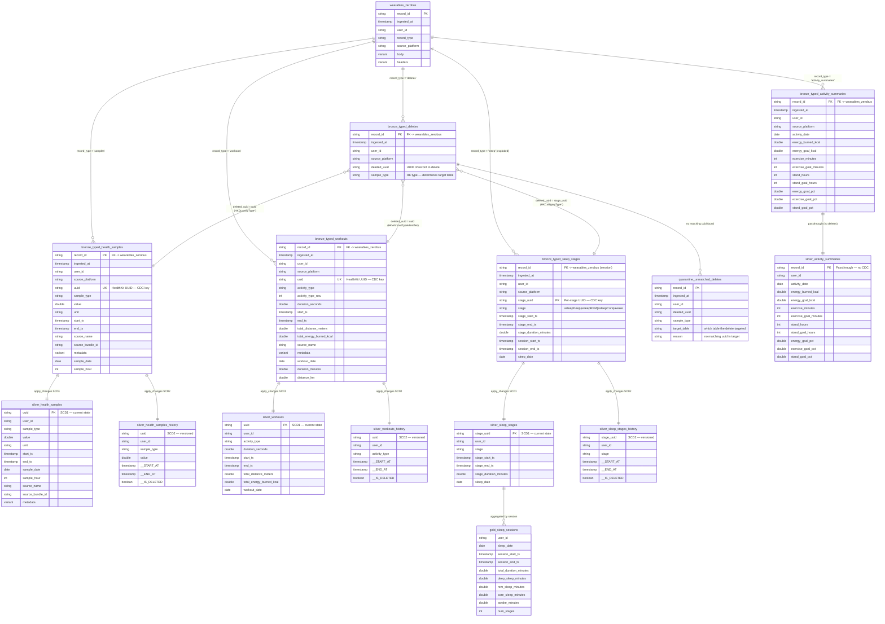

# HealthKit Pipeline — Data Model & Architecture

## Overview

A three-layer Spark Declarative Pipeline that processes raw VARIANT-encoded HealthKit data from the ZeroBus bronze table into typed, delete-aware silver tables with full SCD history.

**Pipeline**: `[dev] Silver HealthKit` (continuous, serverless, Photon)
**Source**: `hls_fde_dev.dev_matthew_giglia_wearables.wearables_zerobus`
**Target schema**: `hls_fde_dev.dev_matthew_giglia_wearables`

---

## Architecture

```
wearables_zerobus (raw bronze — VARIANT, append-only)
│
│  ┌─── STRUCTURING (fan-out by record_type, type VARIANT → columns) ───┐
│  │                                                                      │
├──►  bronze_typed_health_samples    (one row per sample, keyed on uuid)
├──►  bronze_typed_workouts          (one row per workout, keyed on uuid)
├──►  bronze_typed_sleep_stages      (one row per STAGE, exploded, keyed on stage uuid)
├──►  bronze_typed_activity_summaries(one row per day per user)
├──►  bronze_typed_deletes           (one row per delete event)
│  │                                                                      │
│  └──────────────────────────────────────────────────────────────────────┘
│
│  ┌─── CDC VIEWS (UNION typed records + matching deletes, tag operation) ──┐
│  │                                                                         │
│  │  cdc_health_samples_v    (INSERT from samples, DELETE from deletes)
│  │  cdc_workouts_v          (INSERT from workouts, DELETE from deletes)
│  │  cdc_sleep_stages_v      (INSERT from stages, DELETE from deletes)
│  │                                                                         │
│  └─────────────────────────────────────────────────────────────────────────┘
│
│  ┌─── SILVER (apply_changes — deletes physically applied) ────────────────┐
│  │                                                                         │
├──►  silver_health_samples          (SCD Type 1 — current state only)
├──►  silver_health_samples_history  (SCD Type 2 — full change history)
├──►  silver_workouts                (SCD Type 1)
├──►  silver_workouts_history        (SCD Type 2)
├──►  silver_sleep_stages            (SCD Type 1)
├──►  silver_sleep_stages_history    (SCD Type 2)
├──►  silver_activity_summaries      (streaming table — no deletes exist)
│  │                                                                         │
│  └─────────────────────────────────────────────────────────────────────────┘
│
│  ┌─── QUARANTINE ─────────────────────────────────────────────────────────┐
│  │                                                                         │
├──►  quarantine_unmatched_deletes   (deletes with no matching record)
│  │                                                                         │
│  └─────────────────────────────────────────────────────────────────────────┘
│
│  ┌─── GOLD (aggregations & metric views) ─────────────────────────────────┐
│  │                                                                         │
├──►  gold_sleep_sessions            (re-aggregated from non-deleted stages)
├──►  (future metric views)
│  │                                                                         │
│  └─────────────────────────────────────────────────────────────────────────┘
```

---

## Entity Relationship Diagram



---

## Table Inventory

### Layer 1: Bronze Typed (Structured, Append-Only)

These tables structure the raw VARIANT data into typed columns. They are **append-only streaming tables** that serve as the full audit trail. No records are ever removed.

| Table | Grain | PK / CDC Key | Cluster Keys | Source Filter |
| --- | --- | --- | --- | --- |
| `bronze_typed_health_samples` | One row per sample | `uuid` | user_id, sample_type, sample_date | `record_type = 'samples'` |
| `bronze_typed_workouts` | One row per workout | `uuid` | user_id, activity_type, workout_date | `record_type = 'workouts'` |
| `bronze_typed_sleep_stages` | One row per sleep stage | `stage_uuid` | user_id, sleep_date | `record_type = 'sleep'` (exploded) |
| `bronze_typed_activity_summaries` | One row per user per day | `record_id` | user_id, activity_date | `record_type = 'activity_summaries'` |
| `bronze_typed_deletes` | One row per delete event | `record_id` | sample_type, deleted_uuid | `record_type = 'deletes'` |

### Layer 2: Silver (CDC-Applied, Delete-Aware)

These tables are produced by `dlt.apply_changes()`. Each entity has **both** SCD Type 1 (current state, deletes physically removed) and SCD Type 2 (full history with `__START_AT`, `__END_AT`, `__IS_DELETED` columns).

| Table | SCD Type | CDC Key | Sequence By | Delete Condition |
| --- | --- | --- | --- | --- |
| `silver_health_samples` | 1 | `uuid` | `ingested_at` | `operation = 'DELETE'` |
| `silver_health_samples_history` | 2 | `uuid` | `ingested_at` | `operation = 'DELETE'` |
| `silver_workouts` | 1 | `uuid` | `ingested_at` | `operation = 'DELETE'` |
| `silver_workouts_history` | 2 | `uuid` | `ingested_at` | `operation = 'DELETE'` |
| `silver_sleep_stages` | 1 | `stage_uuid` | `ingested_at` | `operation = 'DELETE'` |
| `silver_sleep_stages_history` | 2 | `stage_uuid` | `ingested_at` | `operation = 'DELETE'` |
| `silver_activity_summaries` | N/A | `record_id` | N/A | No deletes (streaming table) |

### Layer 3: Gold (Aggregations)

| Table | Type | Source | Grain |
| --- | --- | --- | --- |
| `gold_sleep_sessions` | Materialized View | `silver_sleep_stages` | One row per user per sleep session |

### Quarantine

| Table | Purpose |
| --- | --- |
| `quarantine_unmatched_deletes` | Delete events whose `deleted_uuid` has no matching record in the target bronze typed table. Expected to be ~99% of sample deletes in dev (historical orphans from HealthKit anchored queries). Valuable in production for detecting sync ordering issues. |

---

## CDC Design

### How Deletes Map to Tables

The `sample_type` field in delete records determines which table the delete targets:

| sample_type Pattern | Target Table | CDC Key |
| --- | --- | --- |
| `HKQuantityType*` (HeartRate, StepCount, SpO2, HRV, etc.) | `silver_health_samples` | `uuid` |
| `HKWorkoutTypeIdentifier` | `silver_workouts` | `uuid` |
| `HKCategoryTypeIdentifierSleepAnalysis` | `silver_sleep_stages` | `stage_uuid` |
| (none observed) | `silver_activity_summaries` | N/A — no deletes |

### CDC View Pattern

Each CDC view unions INSERT operations (from the bronze typed table) with DELETE operations (from bronze_typed_deletes), creating a unified change feed:

```python
@dlt.view(name="cdc_health_samples_v")
def cdc_health_samples_v():
    inserts = (
        dlt.readStream("bronze_typed_health_samples")
        .withColumn("operation", F.lit("INSERT"))
    )
    deletes = (
        dlt.readStream("bronze_typed_deletes")
        .filter(F.col("sample_type").startswith("HKQuantityType"))
        .select(
            F.col("deleted_uuid").alias("uuid"),
            F.col("ingested_at"),
            F.lit("DELETE").alias("operation"),
        )
    )
    return inserts.unionByName(deletes, allowMissingColumns=True)
```

### apply_changes Pattern (SCD1 + SCD2)

```python
# SCD Type 1 — current state, deletes physically remove rows
dlt.create_streaming_table("silver_health_samples",
    cluster_by=["user_id", "sample_type", "sample_date"])

dlt.apply_changes(
    target="silver_health_samples",
    source="cdc_health_samples_v",
    keys=["uuid"],
    sequence_by=F.col("ingested_at"),
    apply_as_deletes=F.expr("operation = 'DELETE'"),
    stored_as_scd_type=1,
)

# SCD Type 2 — full history with __START_AT, __END_AT, __IS_DELETED
dlt.create_streaming_table("silver_health_samples_history",
    cluster_by=["user_id", "sample_type", "sample_date"])

dlt.apply_changes(
    target="silver_health_samples_history",
    source="cdc_health_samples_v",
    keys=["uuid"],
    sequence_by=F.col("ingested_at"),
    apply_as_deletes=F.expr("operation = 'DELETE'"),
    stored_as_scd_type=2,
)
```

### Quarantine Pattern

Unmatched deletes are captured via a LEFT ANTI JOIN materialized view:

```python
@dlt.table(name="quarantine_unmatched_deletes")
def quarantine_unmatched_deletes():
    deletes = dlt.read("bronze_typed_deletes")
    samples = dlt.read("bronze_typed_health_samples").select("uuid")
    workouts = dlt.read("bronze_typed_workouts").select("uuid")
    stages = dlt.read("bronze_typed_sleep_stages").select(
        F.col("stage_uuid").alias("uuid")
    )
    all_uuids = samples.union(workouts).union(stages)
    
    return (
        deletes
        .join(all_uuids, deletes.deleted_uuid == all_uuids.uuid, "left_anti")
        .withColumn("target_table", F.when(
            F.col("sample_type").startswith("HKQuantityType"), "silver_health_samples"
        ).when(
            F.col("sample_type") == "HKWorkoutTypeIdentifier", "silver_workouts"
        ).when(
            F.col("sample_type") == "HKCategoryTypeIdentifierSleepAnalysis", "silver_sleep_stages"
        ).otherwise("unknown"))
        .withColumn("reason", F.lit("no matching uuid in target"))
    )
```

---

## Data Volumes (Dev Environment)

| Metric | Value |
| --- | --- |
| Total delete records | 1,445,304 |
| Distinct deleted UUIDs | 667,591 |
| Sample deletes matched | 3,069 / 665,115 (0.46%) |
| Workout deletes matched | 57 / 70 (81%) |
| Sleep stage deletes matched | 1,651 / 2,406 (69%) |
| Expected quarantine rows | ~663,000 (mostly historical sample orphans) |

The low match rate for samples is expected — Apple HealthKit's anchored query returns **all historical deletion events** on first sync, including records that were deleted on-device before ever being synced to Databricks.

---

## Sleep: Stage Grain → Session Aggregation

### Why Stage Grain at Bronze

Apple HealthKit stores sleep data as individual `HKCategoryTypeIdentifierSleepAnalysis` category samples — one per stage (deep, REM, core, awake). The iOS app groups these into "sessions" for convenience, but **HealthKit deletes target individual stages by UUID**, not sessions.

To apply deletes via `apply_changes`, the bronze typed layer must store one row per stage with its UUID as the CDC key.

### Gold Aggregation (Session Reconstruction)

```sql
-- gold_sleep_sessions: re-aggregate non-deleted stages into sessions
SELECT
    user_id,
    sleep_date,
    MIN(stage_start_ts) AS session_start_ts,
    MAX(stage_end_ts) AS session_end_ts,
    SUM(stage_duration_minutes) AS total_duration_minutes,
    SUM(CASE WHEN stage = 'asleepDeep' THEN stage_duration_minutes ELSE 0 END) AS deep_sleep_minutes,
    SUM(CASE WHEN stage = 'asleepREM' THEN stage_duration_minutes ELSE 0 END) AS rem_sleep_minutes,
    SUM(CASE WHEN stage = 'asleepCore' THEN stage_duration_minutes ELSE 0 END) AS core_sleep_minutes,
    SUM(CASE WHEN stage = 'awake' THEN stage_duration_minutes ELSE 0 END) AS awake_minutes,
    COUNT(*) AS num_stages
FROM silver_sleep_stages
GROUP BY user_id, sleep_date
```

---

## Data Quality Strategy

| Layer | Approach | Rationale |
| --- | --- | --- |
| Bronze Typed | `expect` / `expect_or_drop` | Validate structure during VARIANT extraction. Drop rows with null PKs/UUIDs. |
| Silver (CDC) | Inherits from bronze typed | `apply_changes` operates on pre-validated data. Duplicate deletes are idempotent. |
| Quarantine | Reporting only | Captures orphan deletes for observability. No expectations needed. |
| Gold | `expect` on aggregates | Sanity checks (e.g., session duration > 0, stage sum ≤ total). |

---

## Naming Conventions

| Prefix | Meaning |
| --- | --- |
| `bronze_typed_*` | Structured extraction from VARIANT. Append-only audit trail. |
| `silver_*` | Delete-applied current state (SCD1). Business-ready. |
| `silver_*_history` | Full change history (SCD2). Temporal queries, audit. |
| `gold_*` | Aggregated/derived metrics. Dashboard-ready. |
| `quarantine_*` | Data quality exceptions. Observability. |
| `cdc_*_v` | Internal pipeline views (CDC union feeds). Not materialized externally. |

---

## Key Design Decisions

1. **Bronze typed = audit trail**: Append-only, never mutated. Full lineage back to raw VARIANT via `record_id`.
2. **Stage grain for sleep**: Enables per-stage `apply_changes` since HealthKit deletes target individual stages.
3. **Both SCD1 and SCD2**: Demo versatility — SCD1 for dashboards/queries, SCD2 for temporal analysis and showing DLT capabilities.
4. **Quarantine for unmatched deletes**: Dev data has 99%+ orphan deletes (historical). Production would surface sync issues.
5. **Activity summaries bypass CDC**: Apple doesn't allow deletion of daily ring data. Simple streaming passthrough.
6. **`ingested_at` as sequence key**: Monotonically increasing server timestamp ensures correct ordering of INSERT vs DELETE operations.
7. **Continuous mode**: Near-real-time processing as bronze data arrives from ZeroBus.

---

## Implementation Plan

### Phase 1: Rename & Restructure Bronze Typed Layer
- Rename current `silver_*` tables to `bronze_typed_*`
- Change `silver_sleep_sessions` to `bronze_typed_sleep_stages` (explode stages, one row per stage with `stage_uuid`)
- Adjust expectations and cluster keys accordingly

### Phase 2: CDC Views
- Create `cdc_health_samples_v`, `cdc_workouts_v`, `cdc_sleep_stages_v`
- Each view unions typed records (INSERT) with matching deletes (DELETE)

### Phase 3: Silver apply_changes
- `dlt.create_streaming_table()` for each SCD1 and SCD2 target
- `dlt.apply_changes()` with appropriate keys, sequence, and delete conditions

### Phase 4: Quarantine & Gold
- Quarantine materialized view (LEFT ANTI JOIN unmatched deletes)
- `gold_sleep_sessions` materialized view (stage → session aggregation)

### Phase 5: Constraints & Documentation
- PK/FK RELY constraints on silver tables
- Column comments
- Updated README (this file)
